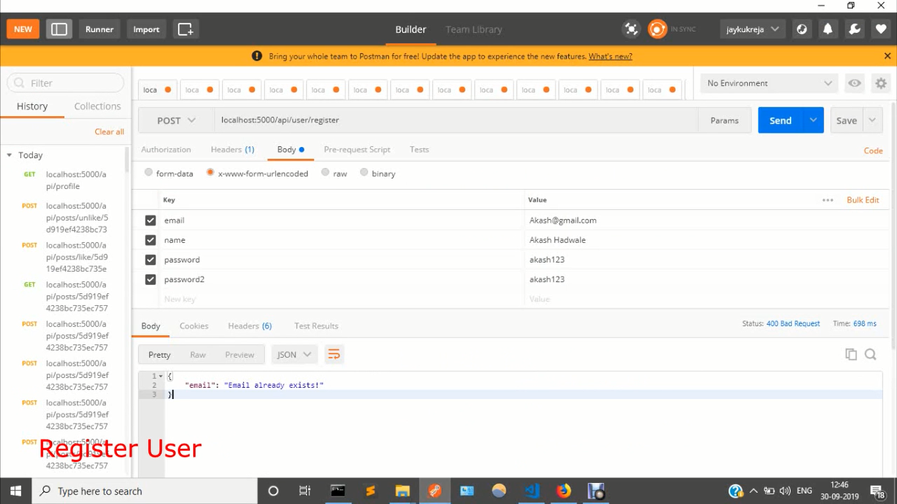
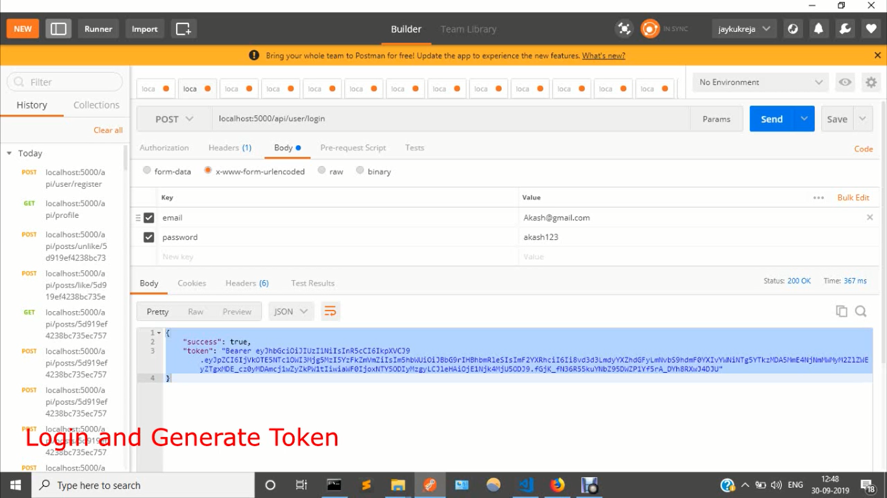
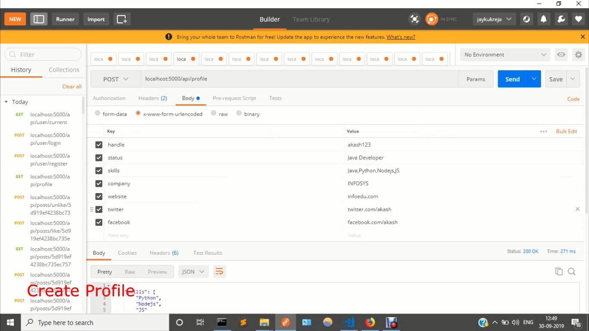
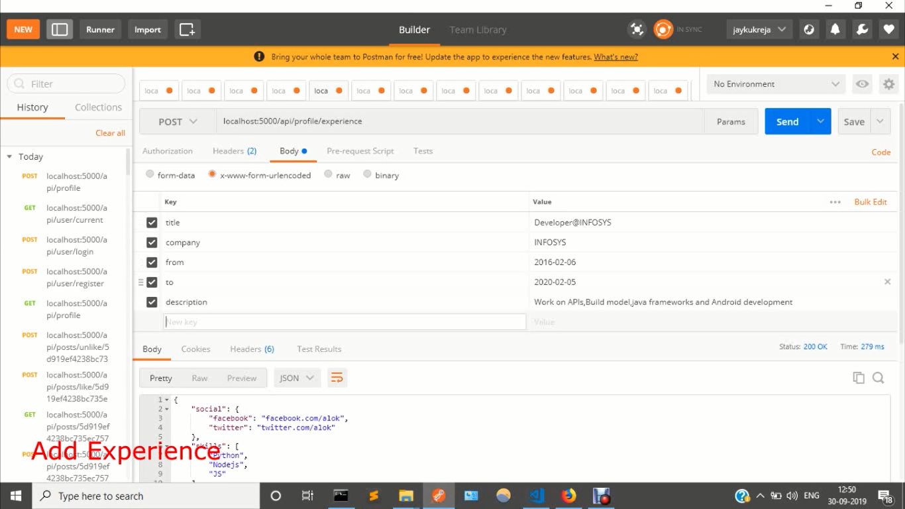
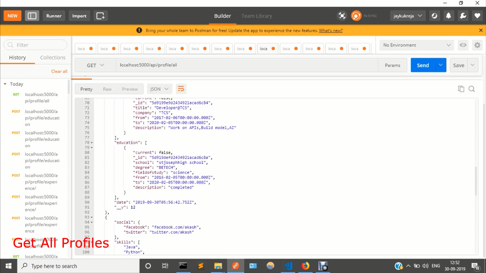
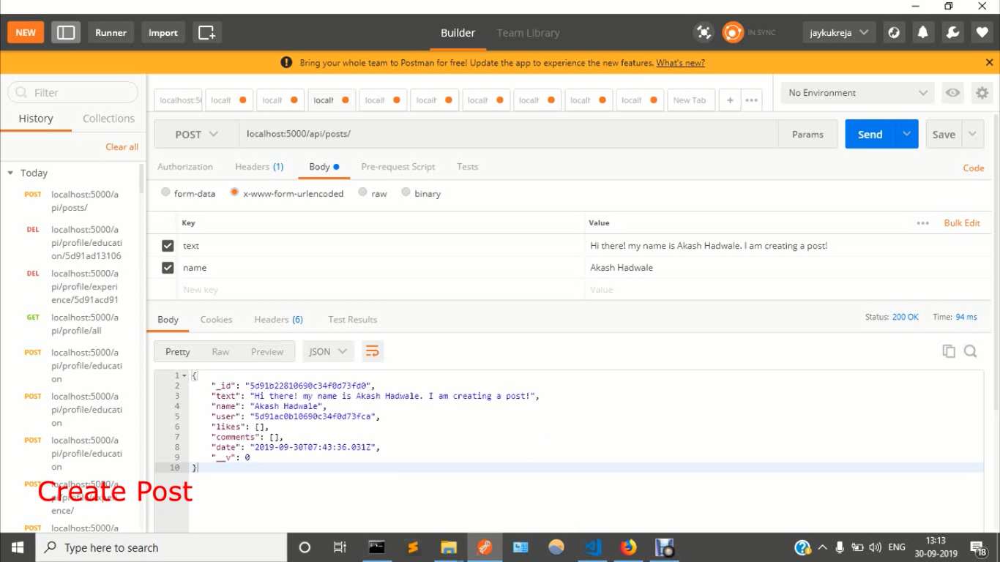
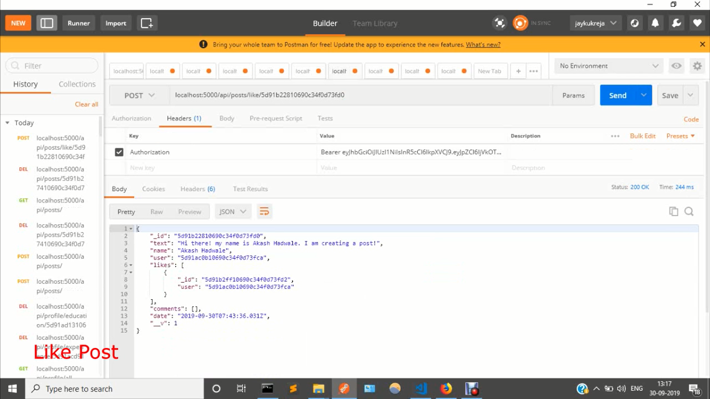
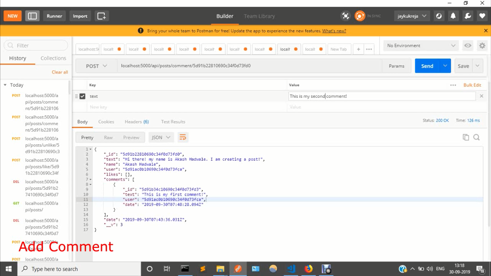

# devNetwork

# DEMO

#### [YouTube](https://youtu.be/6WhdVqCRES8)

## ⛏️ Built With 

- [MongoDB](https://www.mongodb.com/)
- [Express](https://expressjs.com/)
- [NodeJs](https://nodejs.org/en/)
- [Passport-jwt](http://www.passportjs.org/packages/passport-jwt/)
- [bcrypt-nodejs](https://www.npmjs.com/package/bcrypt-nodejs)
- [express-validator](https://www.npmjs.com/package/express-validator)
- [gravatar](https://www.npmjs.com/package/gravatar)

### Configuration:

Replace the **mongoURI** in `/config/keys.js` with URI of your database.
Replace the **secretOrKey** in `/config/keys.js` with your own secret key.

### Get started:

- Clone this repo: `git clone https://github.com/jaykukreja/devnetwork.git`
- Change directory: `cd devnetwork`
- Install required modules: `npm install`
- To run server: `npm start`\
  Get started with [Registration](http://localhost:5000/api/users/register)

## 🧐 CauseCode Coding Challenge 

### Fullstack

    1) Create an inventory management platform for { pick an industry, product or service }. For example, inventory management for TVs.
    2) Create a small social network
    3) Find a website with public profiles and write a scraper to scrape those profiles
    4) Create a realtime video/audio/text chat application

## 🧐 Problem Statement Selected 

    2) Create a small social network

# Commit history to see how your work evolved

- [See Commit History](https://github.com/jaykukreja/devnetwork/commits/master/)

# Screenshots 

# Features:

    Registration and Login
        * User will have to register themselves by providing basic information such as name and email about them and then they can login into the system.
        * Once users have logged in, users will be able to Create Post, Like/Unlike other's Post and Comment.
        * users will be able to :
        -DELETE Post,Profile 
        -ADD/REMOVE Education and Experience
        -Update Profile
        -Delete Profile
        -ADD/REMOVE Comments
        -UPDATE Post
        -DELETE Post
        * Passport JWT Authentication
        * Validation Handlers
        
        

# Functionality

    ❖ Registration
    ❖ Login
    ❖ Update your profile picture and personal details anytime
    ❖ Tools to create posts
    ❖ Like, comment
    ❖ Shows Number of likes and comments
    ❖ Shows all posts, comments on posts
    ❖ You can search a particular user by username, email by id as well

## ✍️ Author 

- [@Jayesh Kukreja](https://github.com/jaykukreja) - devNetwork
